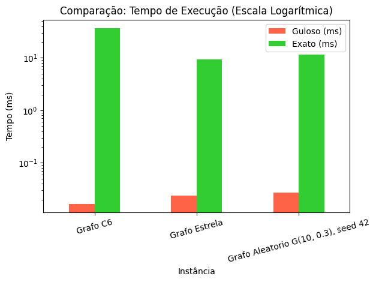

# Lista 7: Subconjuntos Especiais (Independentes, Dominantes e Acoplamentos)

📄 **Documentação e Relatórios**

* [Ver Código Completo e Execução no Google Colab](https://colab.research.google.com/drive/1VtF5V_sHAhDEXcmgLZwqNZcOMX9U3sqO)

---

Este repositório contém a resolução da **Lista de Exercícios 7** da disciplina de Teoria dos Grafos (3º Período — 2026/2), ministrada pelo Prof. Newarney T. Costa. O objetivo principal deste trabalho é implementar, analisar e comparar o desempenho de algoritmos para encontrar Conjuntos Independentes Máximos em diferentes instâncias de grafos.

Comparamos uma **Heurística Gulosa** (rápida, mas que pode cair em ótimos locais) contra uma **Abordagem Exata via Programação Linear Inteira (PLI)** utilizando a biblioteca PuLP, que garante o ótimo global, mas possui custo computacional exponencial.

## 👥 Integrante

* **Messias Junio da Silva Mendes** (Messias-Mendes-Oficial)

## 🛠️ Tecnologias Utilizadas

* **Linguagem:** Python 3
* **Ambiente de Execução:** Google Colab / Jupyter Notebook
* **Bibliotecas:** 
  * `pulp` (Modelagem de Programação Linear Inteira)
  * `pandas` (Estruturação de tabelas de resultados)
  * `matplotlib` (Geração de gráficos comparativos)

## 📊 Resultados Obtidos (Colab)

Foram realizados testes automatizados calculando a média de tempo de 3 execuções para três instâncias distintas. A tabela abaixo resume os resultados obtidos no Colab:

| Instância | Z Guloso | Z Exato | Tempo Médio Guloso (ms) | Tempo Médio Exato (ms) |
| :--- | :--- | :--- | :--- | :--- |
| Grafo C6 | 3 | 3 | 0.0167 | 36.1349 |
| Grafo Estrela | 1 | 6 | 0.0240 | 9.2855 |
| Grafo Aleatório G(10, 0.3) | 3 | 4 | 0.0275 | 11.4900 |

### 📈 Comparativo de Desempenho

  

### 🔍 Conclusões da Análise
1. **Falha da Heurística Gulosa:** O método guloso não encontrou a solução ótima no *Grafo Estrela* (Z=1 vs Exato Z=6) e no *Grafo Aleatório*. Isso ocorre porque o algoritmo toma decisões imediatas baseadas apenas na ordem dos vértices, sem visão global, bloqueando opções melhores.
2. **Tempo de Execução:** O método guloso foi significativamente mais rápido em todas as instâncias (frações de milissegundo).
3. **Escalabilidade do Exato:** Por se tratar de um problema NP-Difícil, o tempo do método exato via PLI cresce exponencialmente à medida que novos vértices $n$ são adicionados.

---
*Desenvolvido para fins acadêmicos - IF Goiano*
